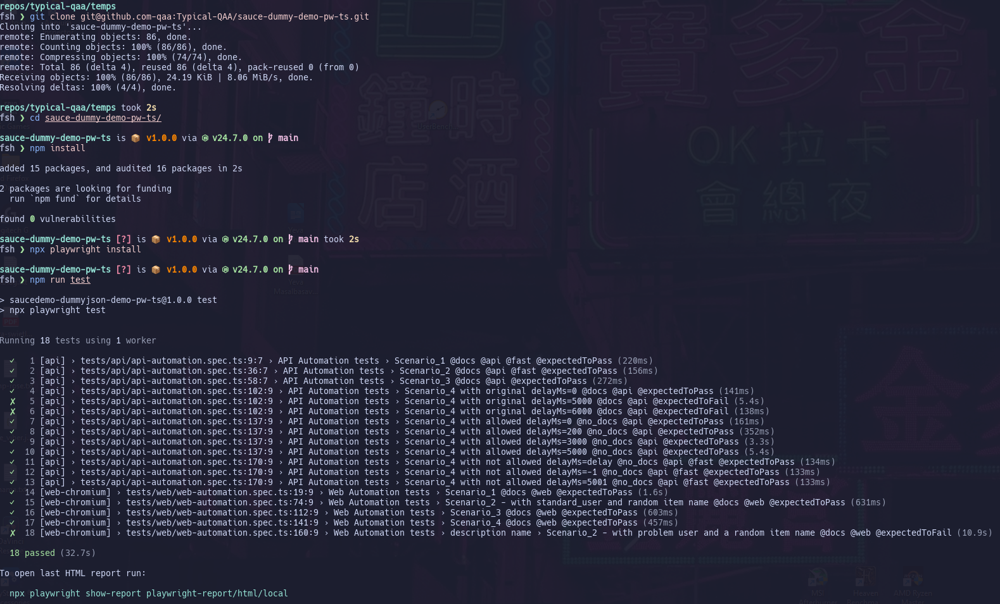

# Disclaimer

This project serves as a proof-of-concept test automation implementation using Playwright + TypeScript for both UI and API testing.

## Test Assumptions and Known Limitations

This project is based on test cases provided as part of a recruitment assessment.

Original test cases:

- **Web automation**: [docs/test-cases/web-automation.md](./docs/test-cases/web-automation.md)
- **API automation**: [docs/test-cases/api-automation.md](./docs/test-cases/api-automation.md)

Before implementing automation, an exploratory analysis was performed and explicit assumptions were defined to:

- clarify unclear requirements,
- document known application limitations,
- explain intentional design decisions in the tests.

All assumptions, interpretations, and edge cases are documented here:

➡️ **[Test Assumptions and Considerations](/docs/assumptions-and-considerations.md)**

This document explains:

- how unclear steps were interpreted,
- why additional validations were introduced,
- how known application limitations (e.g. `problem_user`, fake API behavior, delay constraints) affect test design,
- which behaviors are intentionally not validated.

# Test Automation Framework

This repository contains a test automation framework built in TypeScript using Playwright.
It is designed to test both Web (<https://www.saucedemo.com/>) and API (<https://dummyjson.com/docs>) endpoints. Despite it test different applications, these layers are combined in a single solution because real-world E2E testing often involves both UI and API interactions.
The framework implements the Page Object Model (POM) pattern and factory-based test data generation, along with comprehensive reporting. It is optimized for CI/CD workflows and supports flexible test execution strategies.

## Table of Contents

- [Getting Started](#getting-started)
- [Running the Tests](#running-the-tests)
- [CI/CD (GitHub Actions)](<#ci%2Fcd-(github-actions)>)
- [Framework Considerations](#framework-considerations)
- [Project Structure](#project-structure)

## Getting Started

### Prerequisites

- Node.js (version 18 or higher)
- npm (comes with Node.js)

### Playwright Installation and Project Setup

- Clone the repository:

```bash
git clone <repository_url>
```

- Navigate to the project directory:

```bash
cd sauce-dummy-demo-pw-ts
```

- Install the required dependencies:

```bash
npm install
```

- Install Playwright browsers:

```bash
npx playwright install
```

- (Optional) Set up environment variables:

```bash
echo "PW_BASE_WEB_URL=https://www.saucedemo.com" > .env
echo "PW_BASE_API_URL=https://dummyjson.com" > .env
```

For more detailed installation instructions and options of the Playwright, please refer to the [Official Playwright Installation Guide](https://playwright.dev/docs/intro#installing-playwright).

### Local Test Execution Evidence

- Web test suite: passed
- API test suite: passed



## Running the Tests

To run all tests with the default configuration:

```bash
npm run test
```

Additional test execution options:

```bash
# Run only API tests
npm run test:api

# Run only WEB tests
npm run test:web

# Run tests with browser visible
npm run test:headed

# Run tests in debug mode
npm run test:debug

# Type checking
npm run typecheck
```

To view the HTML report:

```bash
npm run report
```

For CI environments:

```bash
# Run all tests (CI configuration)
npm run ci:test

# Run only API tests
npm run ci:test:api

# Run only WEB tests
npm run ci:test:web
```

## CI/CD (GitHub Actions)

The project includes GitHub Actions workflow configuration for continuous integration that executes both API and UI test suites. The workflow runs on push to main branch, pull requests, and on a cron schedule at 00:00 daily.

Allure reports are configured and deployed to GitHub Pages at **<https://typical-qaa.github.io/sauce-dummy-demo-pw-ts/>**

## Framework Considerations

This test framework is designed to handle the specifics of the project. When you review or run these tests, please keep the following in mind:

- Data Isolation: Each test uses fresh test data to ensure independence
- Factory Pattern: Dynamic test data generation using @faker-js/faker
- Step-based Reporting: Detailed test execution tracking with test.step() wrapping

## Project Structure

This project follows a logical and modular structure to keep the test automation framework organized and maintainable.

### File Structure

- `docs/`: Contains the test case documentation
- `data/`: Test data, validation schemas, constants, and factories
- `environment/`: Configuration files
- `fixtures/`: Playwright fixtures and custom matchers
- `pages/`: Page Object Model implementation
- `routes/`: API client layer
- `support/`: Utility functions and helpers
- `tests/`: Test specifications
- `types/`: TypeScript type definitions

### Design Notes

- The framework implements a pattern similar to **Page Object Model (POM)** for both UI and API testing. All page logic is centralized in the `pages/` folder, and API request logic is in the `routes/` folder, making tests cleaner and more maintainable.
- **API Client Layer**: Base class `ApiBase`. Individual clients extend the base for specific endpoints.
- **Page Object Model**: `BasePage` foundation includes common components.
- **Test Data Management**: Factory pattern for dynamic data generation, static fixtures for validation, and centralized utilities for data management.
- **Testing Infrastructure**: Custom Playwright fixtures inject API clients and test data.
- All operations are wrapped in `test.step()` for detailed reporting and enhanced debugging.
- You can find a number of `NOTE` and `TODO` comments scattered throughout the code. These highlight specific considerations, potential future improvements, or areas for further investigation.
